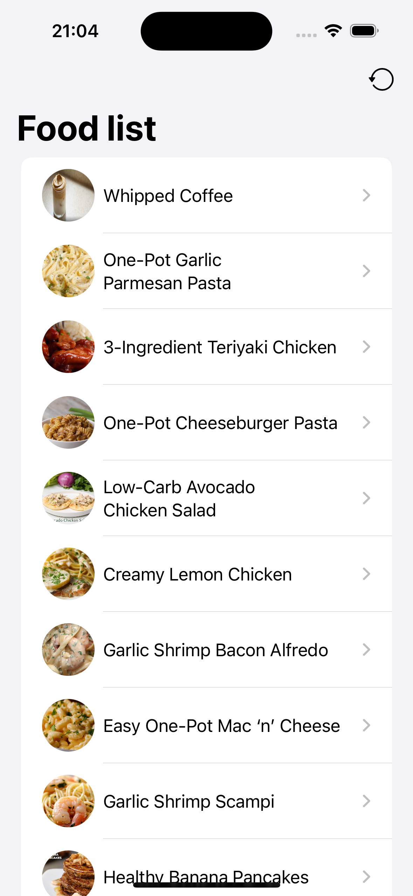
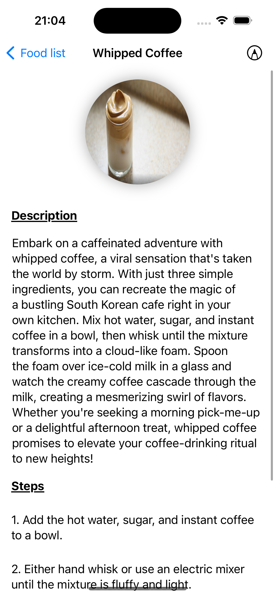
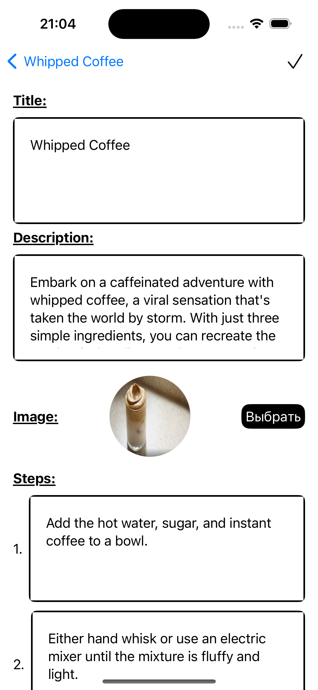

# Soup Recipe

Реализация приложения списка супов.

## About

Стек технологий:

* SwiftUI
* SwiftRX
* Realm
* Alamofire

## How it work

> Возможно: просматривать разные супы, редактировать рецепт. Данные сохраняются локально. Рецепты с сайта: rapidapi.com

## Example

  
  
  

## Support

tg: @swissmer